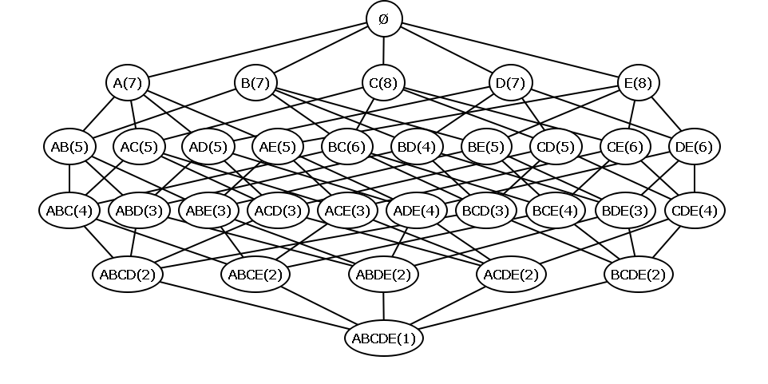

# Практическое задание 4
## Вариант 3
## Задание 1 

*Максимальная оценка задания: **1** балл*

Дан набор данных:

| tid              | itemset |
| ---------------- | ------- |
| *t<sub>1</sub>*  | *CDE*    |
| *t<sub>2</sub>*  | *BC*    |
| *t<sub>3</sub>*  | *ADE*    |
| *t<sub>4</sub>*  | *ABCDE*    |
| *t<sub>5</sub>*  | *BD*    |
| *t<sub>6</sub>*  | *AE*    |
| *t<sub>7</sub>*  | *ACDE*    |
| *t<sub>8</sub>*  | *ACDE*    |

Минимальный уровень поддержки = **4**

1.1 Найдите частые наборы. Для поиска воспользуйтесь собственной реализацией **Apriori** из работы №3 (демонстрация работы алгоритма не требуется)

1.2 Найдите все минимальные генераторы. Оформите этот пункт в виде функции

1.3 К исходным данным добавьте набор ***E*** и повторно найдите все минимальные генераторы. Значение минимального уровня поддержки оставьте без изменений

## Задание 2

*Максимальная оценка задания: **3** балла*

Дана решетка наборов *X<sub>i</sub>* и их частот



Минимальный уровень поддержки = **2**

2.1 Используя решетку наборов и их частот, восстановите изначальный набор данных **T**. Отсортируйте **T** по ключу ```(len(Ti), Ti)``` в порядке возрастания

*\* **T** состоит из 10 тидов, все тиды уникальные*

2.2 Для каждого набора *X<sub>i</sub>* вычислите множество **M<sub>i</sub>** индексов тидов *t<sub>j</sub>* ∈ **T**, в которых содержится этот набор: *M<sub>i</sub> = {j | X<sub>i</sub> ⊆ t<sub>j</sub>}*. Получите множество **P** *= {(X<sub>i</sub>, M<sub>i</sub>)}*

2.3 *Самостоятельно* реализуйте алгоритм **Charm**. Используя полученные пары **P** и алгоритм **Charm**, вычислите список всех закрытых наборов **C** (*closed itemsets*). Продемонстрируйте работу алгоритма. Отсортируйте **C** по ключу ```(len(Ci), Ci)``` в порядке возрастания

*\* оформите пункты 2.1, 2.2, 2.3  в виде отдельных функций*

2.4 В исходных данных добавьте +1 к частоте набора ***BCD*** и повторно получите список всех закрытых наборов. Значение минимального уровня поддержки оставьте без изменений.  Повторная демонстрация работы алгоритма **Charm** не требуется

*\* после изменения частоты изначальный набор данных **T** изменится*

## Задание 3

*Максимальная оценка задания: **2** балла*

Даны последовательности:

| id              | sequence |
| --------------- | -------- |
| *s<sub>1</sub>* | *TATTTATGGTATG*     |
| *s<sub>2</sub>* | *GTACTCTTAGTA*     |
| *s<sub>3</sub>* | *CCCGAGGTGAGCT*     |
| *s<sub>4</sub>* | *GTGTCACATATA*     |
| *s<sub>5</sub>* | *TCGTCTAAAAT*     |

Минимальный уровень поддержки = **4**

3.1 *Самостоятельно* реализуйте алгоритм **GSP** и найдите все подпоследовательности. Продемонстрируйте, как алгоритм перебирает предложенный набор данных. Оформите этот пункт в виде функции

Если будет найдено больше 15 подпоследовательностей, то отобразите только последние (сортировка по количеству символов по возрастанию) 15 значений

3.2 К исходным данным добавьте последовательность ***TCACCC*** и повторно найдите все подпоследовательности. Значение минимального уровня поддержки оставьте без изменений. Повторная демонстрация работы алгоритма не требуется. 

Если будет найдено больше 15 подпоследовательностей, то отобразите только последние (сортировка по количеству символов по возрастанию) 15 значений

## Для справки

1. Машинное обучение. Учебное пособие. Темы: 
   - Суммирование наборов. Максимальная и замкнутая частота наборов. Минимальные генераторы. Пример 5.2
   - Суммирование наборов. Поиск закрытых часто встречающихся наборов элементов: CHARM алгоритм. Алгоритм 5.2
   - Анализ последовательностей. Поиск часто встречающихся последовательностей. Уровневый поиск: GSP. Алгоритм 6.1

