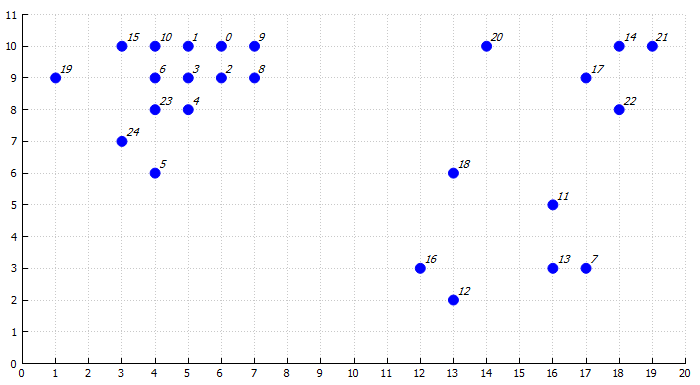

# Практическое задание 5
## Вариант 3
## Задание 1 

*Максимальная оценка задания: **1** балла*

Дан набор точек **D**:

|      | 0    | 1    | 2    | 3    | 4    | 5    | 6    | 7    | 8    | 9    |
| ---- | ---- | ---- | ---- | ---- | ---- | ---- | ---- | ---- | ---- | ---- |
|**x**|19.3|30.4|22.5|37.4|19.7|15.7|32.8|29.5|33|17.2|
|**y**|19.5|23.7|24.1|25.1|26.2|30.3|24|19.5|23|24.6|

Количество кластеров k = **2**

Начальные средние значения (центры кластеров) M = **[(19, 26), (33, 29)]**

Порог сходимости ε = **0.01**

1.1 *Самостоятельно* реализуйте алгоритм **KMeans** для двумерных данных. Вычислите кластеры и их центры. 

Оформите этот пункт в виде функции. Функция должна возвращать найденные кластеры и новые центры кластеров. Каждый кластер должен содержать индексы точек, которые принадлежат этому кластеру

1.2 Постройте диаграмму рассеяния, на которой будут отображены все точки, их принадлежность кластеру, центры кластеров. 

Оформите этот пункт в виде функции. Принадлежность кластеру отобразить цветом точки. Все точки подписать. Точки центров кластеров выделить

1.3 Воспользуйтесь алгоритмом **KMeans** из библиотеки **sklearn** и выведите результат его работы. Сравните результаты собственной и библиотечной реализации

1.4 К исходным данным добавьте точку **(-10, 25)** и повторно вычислите кластеры и их центры. Также постройте диаграмму рассеяния

## Задание 2

*Максимальная оценка задания: **1** балл*

Дан набор значений **X** и вероятностей их принадлежности к кластерам *C1* и *C2*:

| *x*  | *P(C1\|x)* | *P(C2\|x)* |
| ---- | --------------------- | --------------------- |
|14.4|1|0|
|14.2|1|0|
|25.9|0|1|
|26.7|0|1|
|11.4|1|0|
|20.2|0.2|0.8|
|17.1|0.7|0.3|
|13.5|1|0|
|11.8|1|0|
|18.9|0.4|0.6|

2.1 Найдите оценку максимального правдоподобия для средних μ1 и μ2

2.2 Пусть μ1 = **16**, μ2 = **20.4** и σ1 = **2.5**, σ2 = **2.1**. Априорные вероятности каждого кластера P(*C1*) = **0.5**, P(*C2*) = **0.5**.

Найдите вероятности принадлежности точки x = **19** к кластерам *C1* и *C2*

## Задание 3

*Максимальная оценка задания: **2** балла*

Даны категориальные данные размерности 5:

|           | *X1* | *X2* | *X3* | *X4* | *X5* |
| --------------- | -------- | --------------- | --------------- | --------------- | --------------- |
|**x0**|0|1|0|0|0|
|**x1**|1|1|1|1|0|
|**x2**|1|1|0|0|1|
|**x3**|0|0|0|0|0|
|**x4**|1|0|0|1|1|
|**x5**|0|0|1|1|1|

Близость двух наблюдений определяется через количество совпадений и несовпадений значений признаков. Допустим, что n11 это количество признаков, одновременной равных 1 для наблюдений xi и xj, и n10 это количество признаков, равных 1 для наблюдения xi и в то же время равных 0 для наблюдения xj. По аналогии определяются n01 и n00:

| xi \ xj |       1        |       0        |
| :---------------------------: | :------------: | :------------: |
|               1               | n11 | n10 |
|               0               | n01 | n00 |

Даны следующие метрики:

- Коэффициент простого совпадения
  $$
  SMC({\bf x}_i,{\bf x}_j)= \frac{n_{11}+n_{00}}{n_{11}+n_{10}+n_{01}+n_{00}}
  $$
  
- Коэффициент Жаккара
  $$
  JC({\bf x}_i,{\bf x}_j)= \frac{n_{11}}{n_{11}+n_{10}+n_{01}}
  $$

- Коэффициент Рассела и Рао
  $$
  RC({\bf x}_i,{\bf x}_j)= \frac{n_{11}}{n_{11}+n_{10}+n_{01}+n_{01}}
  $$

*Самостоятельно* реализуйте алгоритм **AgglomerativeClustering** (агломеративная иерархическая кластеризация). В качестве результата выведите список кластеров, возникающих на каждом шаге работы алгоритма.

Выполните иерархическую кластеризации и постройте дендрограммы по результатам кластеризации для следующих параметров алгоритма:

3.1 Метод одиночной связи с метрикой **RC**

3.2 Метод полной связи с метрикой **SMC**

3.3 Метод средней связи с метрикой **JC**

На дендрограммах подпишите точки (по оси x) и уровни (по оси y)

## Задание 4

*Максимальная оценка задания: **2** балла*

Дан рисунок:

Даны следующие метрики:

- Метрика **1**
$$
L_{N}({\bf x},{\bf y})= \sqrt{\sum_{i=1}^n{(x_i-y_i)^2}}
$$
- Метрика **2**
$$
L_{\frac{1}{2}}({\bf x},{\bf y})= (\sum_{i=1}^n{\sqrt {|x_i-y_i|}})^2
$$
- Метрика **3**
$$
L_{max}({\bf x},{\bf y})= \max_{i=1}^n\{{|x_i-y_i|}\}
$$
- Метрика **4**
$$
L_{min}({\bf x},{\bf y})= \min_{i=1}^n\{{|x_i-y_i|}\}
$$
- Метрика **5**
$$
L_{pow}({\bf x},{\bf y})= \sqrt{\sum_{i=1}^n2^{i-1}(x_i-y_i)^2}
$$

*Самостоятельно* реализуйте алгоритм **DBSCAN**. В качестве результата выведите список кластеров **C**, базовых точек **O**, граничных точек **B**, выпавших точек (шумов) **N**. Постройте диаграмму рассеяния, на которой будут отображены все точки, отображена их принадлежность кластеру, а также выпавшие точки (вид диаграммы аналогичен диаграмме из задания 1.2)

Выполните кластеризацию и построение диаграмм для следующих параметров алгоритма:

4.1 Метрика **1**, ϵ = **2**, minPts = **3**

4.2 Метрика **2**, ϵ = **3**, minPts = **5**

4.3 Метрика **3**, ϵ = **1**, minPts = **2**

4.4 Метрика **4**, ϵ = **3**, minPts = **4**

4.5 Метрика **5**, ϵ = **3**, minPts = **5**

## Для справки

1. Машинное обучение. Учебное пособие. Темы: 
   - Глава 8. Репрезентативная кластеризация. Алгоритм K-средних. Алгоритм 8.1
   - Глава 8. Оценка максимального правдоподобия. Оценка среднего значения.
   - Глава 9. Иерархическая кластеризация. Агломеративная иерархическая кластеризация. Алгоритм 9.1
   - Глава 10. Кластеризация, основанная на плотности. Алгоритм DBSCAN. Алгоритм 10.1
2. [Sklearn KMeans](https://scikit-learn.org/stable/modules/generated/sklearn.cluster.KMeans.html)

3. [Scipy Dendrogram](https://docs.scipy.org/doc/scipy/reference/generated/scipy.cluster.hierarchy.dendrogram.html)
